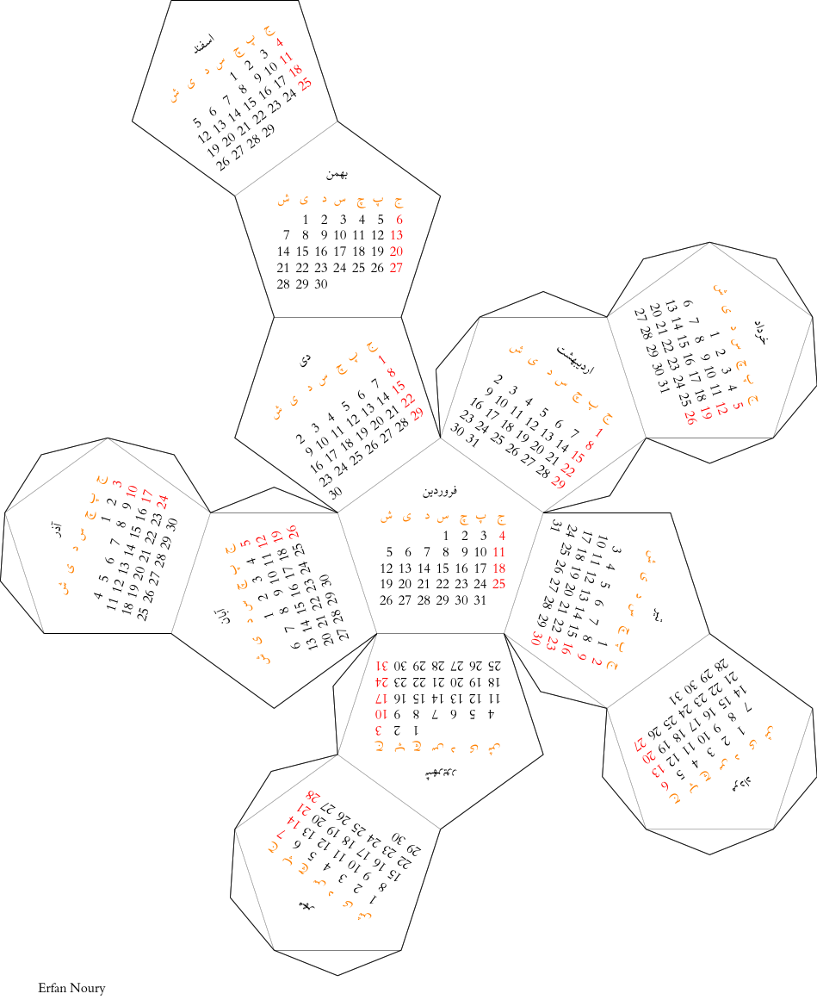

# Dodecahedron Persian Calendar for 1396
This calendar is created using TikZ. I couldn't make it show the numbers in Persian, so if you know how, please send a PR. I have also provided the `.tex` source code, so you can customize it however you want. PDF file is also provided so that you can print it out.

